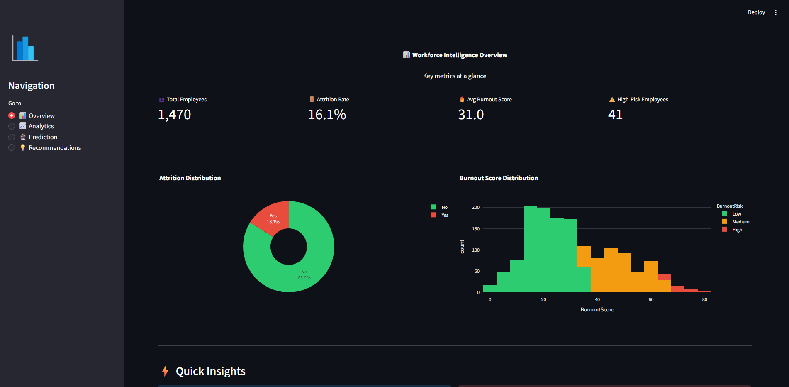
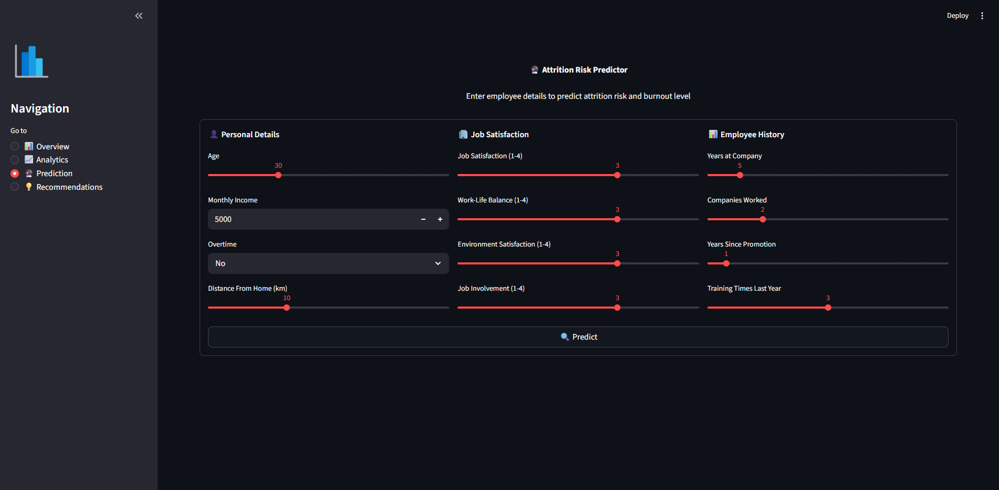

# WorkSense — Workforce Burnout & Attrition Intelligence System

An HR analytics platform that identifies employee burnout patterns and predicts attrition risk using data analytics, interactive visualizations, and machine learning.

🔗 **Live Demo:** [worksense.streamlit.app](https://worksense.streamlit.app](https://worksense-veyfimpyt5rwpd2eqlf2xj.streamlit.app/)

---

## Dashboard Preview

### Overview — KPI Metrics & Burnout Distribution


### Attrition Risk Predictor


---

## Problem Statement

Employee attrition costs organizations heavily — from recruitment expenses to lost institutional knowledge and team productivity drops. Most companies react to attrition *after* it happens instead of predicting and preventing it.

This project builds a data-driven system that:
- Analyzes workforce data to find attrition patterns
- Computes a custom burnout risk score for each employee
- Predicts which employees are likely to leave using machine learning
- Generates HR recommendations based on risk factors

---

## Features

**Data Analysis & Visualization**
- EDA with 8+ Plotly charts
- Department-wise, overtime, salary, satisfaction, and age-based attrition analysis
- Feature correlation heatmap

**Burnout Score Engine**
- Custom weighted scoring system (0-100 scale)
- Factors: overtime, job satisfaction, work-life balance, promotion history, income
- Classifies employees into Low / Medium / High burnout risk categories

**Machine Learning Prediction**
- Random Forest Classifier trained on IBM HR Analytics dataset
- Predicts attrition risk with confidence scores
- Feature importance analysis showing top attrition drivers

**Dashboard (Streamlit)**
- Overview with KPI metrics (attrition rate, avg burnout, high-risk count)
- Analytics section with all visualizations
- Prediction tool — enter employee details and get instant risk assessment
- Recommendations engine with rule-based HR action items

---

## Tech Stack

| Tool                 | Purpose                                  |
|----------------------|------------------------------------------|
| Python               | Core programming language                |
| Pandas & NumPy       | Data manipulation and analysis           |
| Matplotlib & Seaborn | Static visualizations (notebook)         |
| Plotly               | Interactive charts (dashboard)           |
| Scikit-learn         | Machine learning (Random Forest)         |
| Streamlit            | Web dashboard                            |
| Jupyter Notebook     | Analysis walkthrough                     |

---

## Project Structure

```
WorkSense/
│
├── data/
│   └── employee_attrition.csv
│
├── notebooks/
│   └── analysis.ipynb
│
├── models/
│   └── attrition_model.pkl
│
├── screenshots/
│   ├── dashboard_overview.png
│   └── prediction_tool.png
│
├── app.py
├── utils.py
├── requirements.txt
└── README.md
```

| File / Directory | Description |
|---|---|
| `notebooks/analysis.ipynb` | Complete analytics walkthrough — EDA, burnout scoring, ML training |
| `app.py` | Streamlit dashboard application |
| `utils.py` | Helper functions — data processing, charts, recommendations |
| `models/attrition_model.pkl` | Trained Random Forest model |

---

## Installation & Setup

**Prerequisites:** Python 3.8+

1. Clone the repository
```bash
git clone https://github.com/MaitreyGholap/WorkSense.git
cd WorkSense
```

2. Install dependencies
```bash
pip install -r requirements.txt
```

3. Run the Jupyter notebook first (trains and saves the model)
```bash
cd notebooks
jupyter notebook analysis.ipynb
```
Run all cells — this generates `models/attrition_model.pkl`.

4. Launch the Streamlit dashboard
```bash
cd ..
streamlit run app.py
```

The dashboard will open at `http://localhost:8501`

---

## Dataset

**IBM HR Analytics Employee Attrition** — 1,470 employee records with 35 features including demographics, job details, satisfaction scores, and attrition status.

Source: [IBM HR Analytics on Kaggle](https://www.kaggle.com/datasets/pavansubhasht/ibm-hr-analytics-attrition-dataset)

---

## How the Burnout Score Works

The burnout score is a weighted composite metric (0-100) based on five workplace stress factors:

| Factor                  | Max Points | Reasoning                                          |
|-------------------------|------------|-----------------------------------------------------|
| Overtime                | 30         | Strongest burnout driver in the data               |
| Job Satisfaction        | 20         | Inverted scale — lower satisfaction = higher score |
| Work-Life Balance       | 20         | Inverted scale — poor balance = higher score       |
| Years Since Promotion   | 15         | Career stagnation indicator (capped at 10 years)   |
| Monthly Income          | 15         | Below-median income adds financial stress          |

**Risk Levels:** Low (0-35) · Medium (36-65) · High (66-100)

---

## Future Improvements

- Integration with Power BI for enterprise reporting
- Employee sentiment analysis using survey text data
- Real-time monitoring dashboard with live data feeds
- Hyperparameter tuning and model comparison (XGBoost, Gradient Boosting)
- API endpoint for integration with existing HR systems
- Retention cost calculator based on attrition predictions
